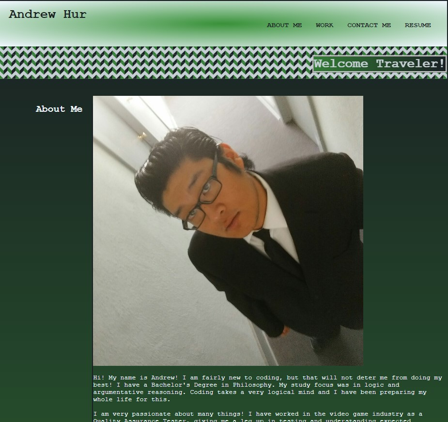

# 02-Portfolio
## My Personal Porfolio
### I wanted to make a website that would be able to showcase my projects as well as a website that I can constantly update with any new projects
## Technology Used
* HTML
    * Using basic html to anchor and link parts of the website to other places on the webpage and outside the webpage
* CSS
    * Using style sheets to control the location of objects on the webpage as well as setting attributes to objects to move and transform. Making the webpage viewable when changing screen size
* GitHub
    * Using GitHub to push and pull projects.
* VSCode
    * Using VSCode with terminal extension to create proper files and editing files.
## Overview

## Summary
* Used CSS to create user-friendly and responsive design.
    * Used CSS to make sure that the page is responsive at every screen size.
    * Used CSS to style objects within the webpage.
    * Used CSS to change and transform objects when hovering over the images.
* Used HTML to structure the contents of the website
    * Used anchors to link within the webpage.
    * Used mailto and callto functions for contacts.
    * Used anchor to create a download link to my resume.
## Resources Used
* [GitHub Markdown Cheatsheet](https://github.com/tchapi/markdown-cheatsheet/blob/master/README.md "GitHub markdown-cheatsheet")
* [w3schools](https://www.w3schools.com/ "w3chools")
* [css-tricks guide](https://css-tricks.com/wp-content/uploads/2022/02/css-flexbox-poster.png "Flex Box Diagram")
* [cssgradient.io](https://cssgradient.io/ "css gradient")
## Author Links
[GitHub](https://github.com/ATHur1104 "Andrew's GitHub Page")